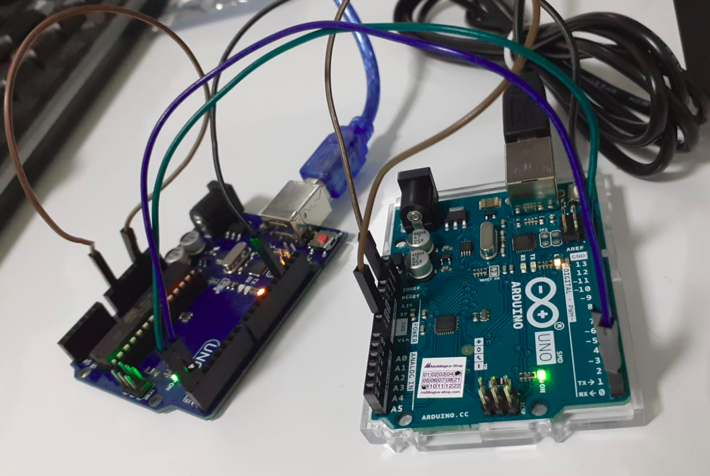
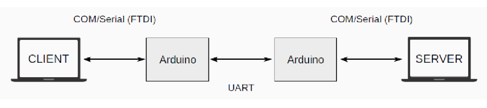

<br/>
<div align="center">
  <h2>💻️ UART-Protocol</h2>
</div>
</br>

Projeto que possibilita a transmissão de um arquivo por meio da comunicacao serial do Arduino.

A montagem deve ser realizada como a imagem abaixo, sendo necessário para isso:

- 2 Arduinos
- Jumpers
- 2 cabos USB AM/BM 2.0

<br/>

---

### Protocolo

---

#### ⚙️ Configuração Padrão 

- baudrate 115200 
- 1 STOP BIT
- SEM BIT DE PARIDADE
- BYTESIZE de tamanho 8

#### 📨️ Datagrama

A estrutura do pacotes que serão enviados, é a demonstrada a seguir:

<br/>

**HEADER**:

- **h1** : tipo de mensagem.
- **h2 / h3** : livre. 
- **h4** : o numero total de pacotes do arquivo.
- **h5** : numero do pacote sendo enviado.
- **h6** : pacote solicitado para recomeço em caso de erro no envio.
- **h7** : último pacote recebido com sucesso.
- **h8 / h9** : CRC - verificação da integrigade do pacote.

<br/>

**PAYLOAD** : variável de 0 a 114 bytes. Reservado a transmissão do arquivo

<br/>

**EOP** : End of Package - 4 bytes - 0xAA 0xBB 0xCC 0xDD

---

### Simulação  -  Possiveis casos

---

- **1.** `Transmissão bem sucedida` do arquivo sem nenhuma intercorrência.

- **2.** `Transmissão com erro na ordem dos pacotes` enviados pelo client, nessa condição é pedindo reenvio do pacote que apresentou o erro, continuando a transmissao até a total transmissão do arquivo.

- **3.** `Transmissão com ausência de resposta de handshake` (pedido de conexão do cliente) por parte do servidor, por mais de 20 segundos. Nessa condição a comunicação é encerrada após 20 segundos.

- **4.** `Transmissão com ausência de resposta de pacote de dados recebido` pelo servidor, por mais de 20 segundos, após esse tempo a conexão é encerrada.

- **5.** `Transmissão com interrupção de envio por menos de 20 segundos e reinício` (manualmente os fios retirados e reconectados no arduino), a transmissao do arquivo deve continuar após tal interferencia, até o seu total envio.


---

### Funcionamento

---

#### 📍️ Montagem

<div align="center">
   
  
</div>

<br/>

<div>
  <p>Pino <b>Tx</b> do Arduino Client ligado ao pino <b>Rx</b> do Arduino Server</p>
  <br/>
  <p>Pino <b>Rx</b> do Arduino Client ligado ao pino <b>Tx</b> do Arduino Server</p>
  <br/>
  <P>Pino <b>Reset</b> ligado ao <b>GND</b> em ambos os Arduinos</p>
  <br/>
  <p>Pino <b>GND</b> do Arduino Server ligado ao pino <b>GND</b> do Arduino Client</p>
 </div>

<br/>

####  ⚡️ Rodagem do código

Baixe as depêndencias necessárias para o funcionamento do código, copiando e colando no terminal o comando abaixo.

```bash

pip install -r requirements.txt

```
Conecte os arduinos aos computadores e por meio de jumpers ligue também os dois arduinos entre si.
Escolha um computador para ser o Server da aplicação, e rode em seu terminal o comando a seguir:

```bash

python server.py

```

O outro computador será o Client da aplicação. Dessa forma, digite em seu terminal o comando:

```bash

python client.py

```
No prompt de comando surgirar um display de opções da ação que se deseja realizar, selecione uma das opções, espere o fim da transmissão e verifique se no computador Server o arquivo chegou em sua total integridade. 

Tente enviar outros arquivos, teste todas as possibilidades de ação do display e divirta-se !  
